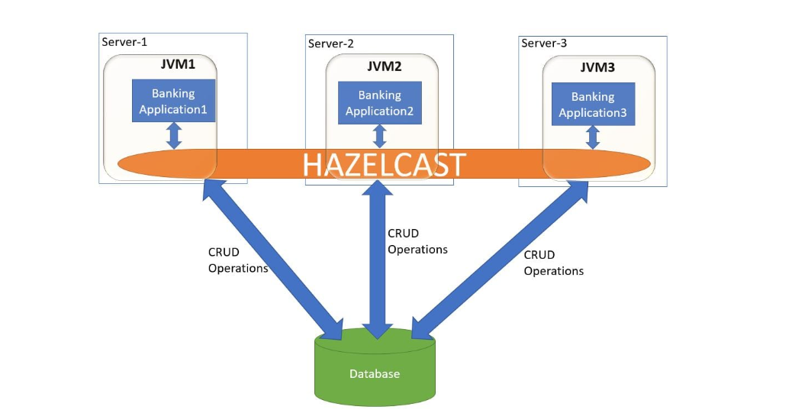
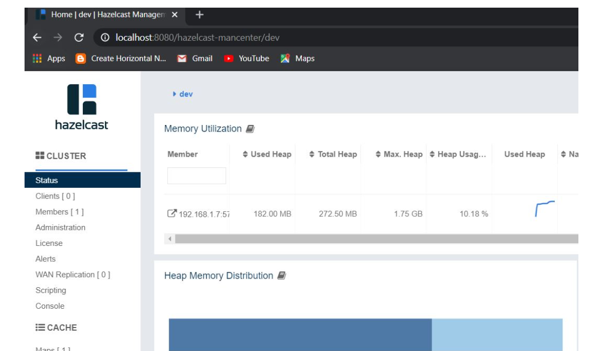

# **boot-hazelcast**

This application connect with multiple node of hazelcast and achieve the Hazelcast caching.

This application connect to hazelcast node and perform CRUD operation on country data.

The hazelcast management console shows the memory utilization of the cluster.

